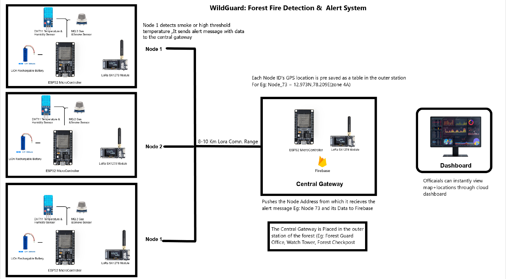

# WildGuard – IoT-based Forest Fire Alert System

## Overview
WildGuard is a prototype IoT solution designed to monitor and detect forest fire risks using **ESP32, LoRa, and Firebase Cloud Dashboard**.

## Features
- Real-time fire and smoke detection (DHT11 + MQ2)
- Long-range communication using LoRa SX1278
- Cloud dashboard with Node ID → GPS mapping
- Event-triggered alerts (only the active node transmits)

## Architecture

## Prototype

## Future Scope
- TinyML-powered risk prediction
- Large-scale deployment with 100+ nodes
- Mobile app integration

